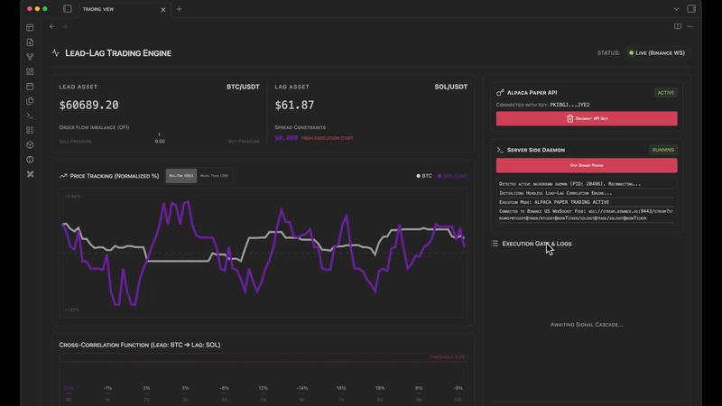

<div align="center">
  <a name="readme-top"></a>
  
  <h1 align="center">TRADING VIEW</h1>
  <h3 align="center"> Lead-Lag Crypto Correlation Engine </h3>
</div>

<div align="center">
  <!-- TOP PURPLE LINKS -->
  <a href="https://beto.group"></a>
  <a href="https://discord.com/invite/6rDp4q4Y2B"></a>
  <a href="https://github.com/sponsors/beto-group"></a>
  <br/>
  <!-- BOTTOM GOLD TAXONOMY -->
  
  
  
  <br/>
  <span style="display:inline-block; margin-top:8px;">[ 🛡️ @Security: Keychain-Secured ]</span>
  <span style="display:inline-block; margin-top:8px;">[ 🖥️ @Shell: Native-Shell-Resolution ]</span>
  <hr>
</div>



<div align="center">
  <p>
    <i> A real-time, zero-cost proprietary trading dashboard that analyzes order flow and cross-correlation between leading and lagging crypto assets. </i>
  </p>
  <hr style="width:30%;">
</div>

Welcome to **Trading View**. This component provides a local, high-frequency dashboard designed to calculate statistical cross-correlation and order flow imbalance (OFI) on live cryptocurrency tick data via public WebSockets.

---

## ✨ Features

### 📡 Data Ingestion & Analysis
*   💹 **Real-Time WebSocket Engine**: Streams tick-by-tick public trade and limit order book data directly from Binance at zero cost.
*   📐 **Cross-Correlation Function (CCF)**: Continually measures the microsecond lag correlation between a Lead asset (BTC) and a Lag asset (SOL).
*   📉 **Order Flow Imbalance (OFI)**: Evaluates bid/ask pressure at the top of the order book to confirm signal direction.

### 🛡️ Runtime & Performance
*   🏎️ **In-Memory Ring Buffers**: Uses sliding windows to maintain high read/write performance on tick data directly in memory.
*   🧹 **Anti-Bleed Style Isolation**: Scopes layout components under rigid container class keys, preventing CSS leakage into host Obsidian workspace configurations.
*   🔌 **Immersive Full-Tab Dashboard**: Uses Datacore's native reparenting to present an edge-to-edge trading workspace overlay.

---

## 📦 Directory Index & Components

The package exposes the following compiled files:

| File | Description |
| :--- | :--- |
| **[TRADING VIEW.md](TRADING%20VIEW.md)** | The main entry point leaf designed to be loaded inside Obsidian panes. |
| **[src/index.jsx](src/index.jsx)** | Main bootstrap application loader and full-tab viewport injector. |
| **[METADATA.md](METADATA.md)** | Packaging manifest outlining indexing, target, and security configurations. |
| **[CONTRIBUTION.md](CONTRIBUTION.md)** | Contributor architecture standards and local compilation guidelines. |
| **[LICENSE.md](LICENSE.md)** | MIT open-source license. |

---

## 🤖 AI Agent Integration (MCP Bridge)

The component includes a native **MCP Bridge** to allow AI coding assistants and autonomous agents to monitor market data and execute paper trades directly through the UI.

### 1. Monitoring Component State
AI agents can read [mcp_state.json](file:///_RESOURCES/DATACORE/_DONE/TRADING%20VIEW/data/mcp_state.json) to retrieve real-time state:
*   **connectionStatus**: `'Connected'`, `'Connecting'`, or `'Disconnected'`.
*   **activeHost**: Current WebSocket connection node (`stream.binance.com` or fallback `stream.binance.us`).
*   **leadAsset (BTC)** & **lagAsset (SOL)**: Instantaneous prices, OFI (Order Flow Imbalance), and spreads.

### 2. AI-Triggered Trade Execution
To execute a trade or reload the component, the AI writes a command payload directly to [mcp_commands.json](file:///_RESOURCES/DATACORE/_DONE/TRADING%20VIEW/data/mcp_commands.json). 

The component checks this file every 1.5 seconds. If it finds `executed: false`, it triggers the operation, locks the state to prevent duplicate fills, and writes back the execution results.

#### Buy Command Example:
```json
{
  "action": "buy",
  "qty": 5,
  "executed": false
}
```

#### Sell Command Example:
```json
{
  "action": "sell",
  "qty": 10,
  "executed": false
}
```

#### Reload UI Example:
```json
{
  "action": "reload",
  "executed": false
}
```
Once processed, the component automatically updates the command file to:
```json
{
  "action": "buy",
  "qty": 5,
  "executed": true,
  "executedAt": "2026-06-07T03:22:04.120Z",
  "status": "success",
  "result": {
    "id": "alpaca-order-uuid-here"
  }
}
```

